# Higher or Lower?

Higher or Lower is an interactive game requiring users to guess whether the next number will be higher or lower than the previous acorss 5 cards.
The purpose is to have fun trying to complete all 4 rounds.

The site can be accessed from this [link](https://elerihulme.github.io/higher-or-lower/)

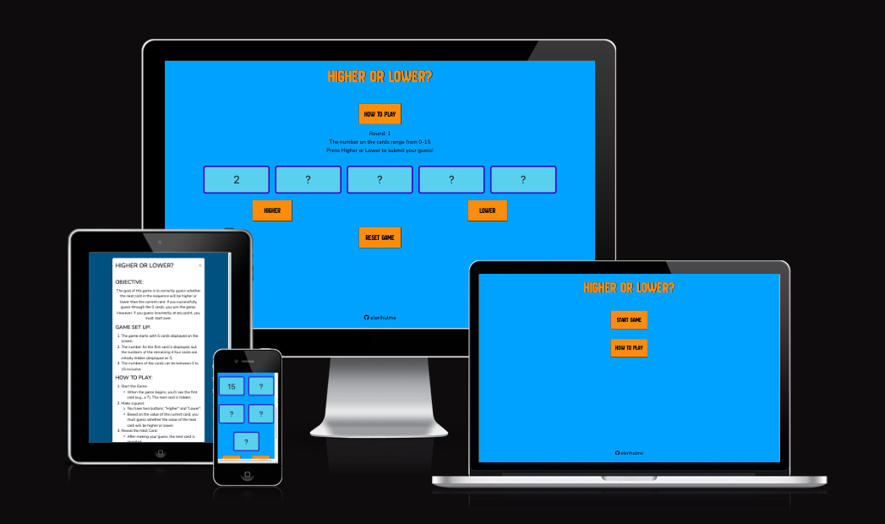

## Overview

The higher or lower game consists of one html page but has three sections that are diplayed at different times and a modal to show the game rules:
- **Start-Section**: has two buttons so the user can either start the game or learn how to play first
- **Game-Section**: has the actual game
- **Results-Section**: section displayed when the user has successfully completed all the rounds
- **How-To-Play-Modal**: pop up modal explaining how to play the game when the 'how to play' button is pressed in either the start or game section

## Technologies Used

- **HTML**: Structure of the website.
- **CSS**: Styling and layout.
- **JavaScript**: Interactivity.
- **Markdown**: Create README.md
- **JQuery**: Interactivity.
- **Bootstrap**: Responsive layouts.
- **Balsamiq**: Make wireframes.
- **Miro**: Workflow creation.
- **GitPod**: Main tool to write and edit code.
- **Git**: Version control.
- **GitHub**: Host the code of the website.
- **GitHub Pages**: Website deployment.
- **Google Chrome Developer Tools**: Website troubleshooting and testing.
- **Google Fonts**: For all fonts used.
- **FontAwesome**: All icons used.

## User Experience Design

### Strategy

#### User Goals

* To have fun playing a easy to understand and simple game.

#### Site Owner Goals

* Provide a game that both they and any visiting users can enjoy.

#### User Stories

##### First Time Visitor Goals:

* To be able to quickly and easily find the instrustions and rules of the game.
* To be able to easily and intuitively navigate and play the game.
* To have prompts throughout the game so I know what to do next.
* To have visual cues so that I know easily where I was right or wrong.

##### Returning and Frequent Visitor Goals:

* To able to start the game quickly and easily.
* To able to play agin quickly and easily when the game has been won or lost.

### Scope

#### Existing Features

##### General

* The website conisits of one html page with different sections visible at different times to keep the website size smaller and increase loading speed.
* The website has it's own custom favicon, making the site look more professional and helping the user to find the correct page if they have several tabs open in their browser

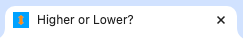

##### Header

* The header is always visible on the webpage to provide consistnecy throughout the game.
* The header consists of the game title "Higher or Lower ?" 
* The header is responsive. When on a small screen the title extends over two lines instead of one

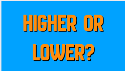

##### Footer

* The footer is always visible on the webpage to provide consistency throughout the game.
* The footer consists of the GitHub logo and my GitHub user game and is a link to my GitHub page.
* The logo and username change colour when the mouse hovers them, to indicate to the user that the text and icon are a clickable link.
* The link opens in a new tab so the user doesn't have any issues finding the game again.
* The footer content already compatible with all device sizes as the content is minimal and easily fits the width of all standard screen sizes. 

##### Start Section

* The start section consists of two buttons: 
 - 'Start Game': which takes the user to the game section .
 - 'How To Play': which opens the how to play modal.
* This gives the user two options: to start playing the game straight away, or to learn how to play the game first.
* The start sections is compatible with all screen sizes as the button are positioned one on top of the other. They are not too wide to fit inside the width of a mobile device, and are not to too tall or spaced out so they are both visible in the device viewport together.

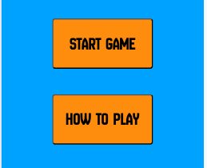

##### Game Section

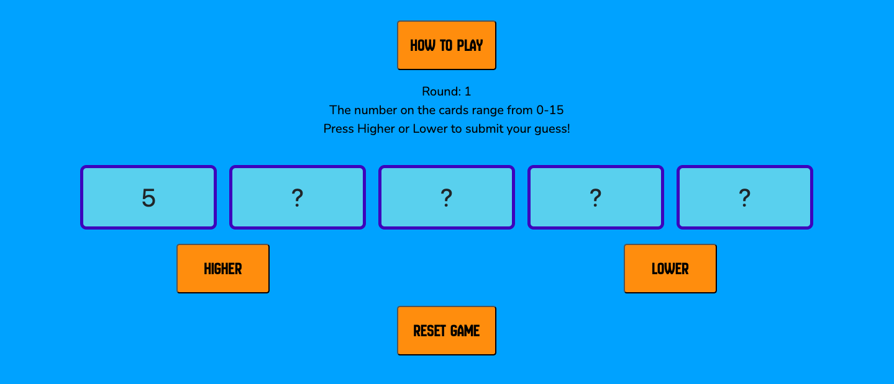

* The game section consists of:
 - 'How To Play Button"
 - A line of text indicating which round the user is currently on. This is automatically set to one at the start of each game and increases with each successful guess.
 - A line of text inofrming the user the range of numbers that are availble for the cards to hekp them make an informed guess.
 - A line of text that helps guide the user through the game by providing instructions about what they should do next and updates about their progress.
 - Five boxes which are the 'cards' used for playing the game. 
 - A higher and a lower button that allow the user to make their guess.
 - A reset button that allows the user to reset the game at any point during the game

* Initally only the first card has a number shown, the others are all marked with a '?', and the numbers get revealled one by one as the user makes guesses, adn the background turns from blue to either green or red to indicate to the user whether their guess was correct or incorrect.
* All buttons have a hover effect to ensure the user knows that they are interactive and clickable. However, the higher and lower buttons are diabled and the hover effect removed when the user guesses incorrectly, to show that the game is over.

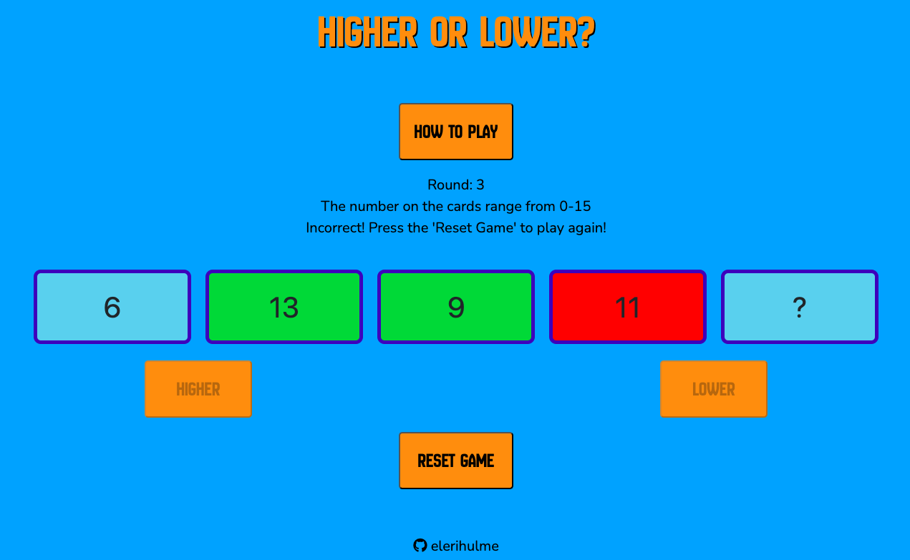

 * The game section is responsive as the cards move to form three lines inside of one when on a mobile device.

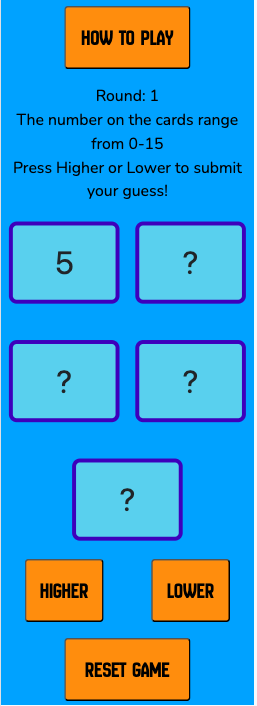

##### Results Section

Results section screen shot

* The results section consists of:
 - A line of text congratulating the user on completeing the game.
 - A 'Play Again' button that takes the play back to the game section and restarts the game for them to play again.

##### How To Play Modal

* The How To Play' modal provides the rules and objectives of the game without taking the user away from the screen they are currrently on, so they do not have to restart the game if they are in the middle of playing. 
* The 'How To Play' modal consists of:
 - A modal header containing the modal title 'Higher or Lower ?', which is the same as the title of the webpage for continuity, and an 'x' button so the user can exit the modal from the top of the modal.
 - The 'Objective' section that outlines the objective of the game.
 - The 'Game Set Up' section that outlines inital state of the gaem before the user starts playing.
 - The 'How To Play' section which details how the player may progress through the game.
 - The winning and losing conditions of the game which outlines how the user wins and loses the game.
 - A modal footer containing a 'close' button so the user can exit the modal from the bottom of the modal.

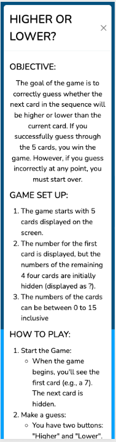
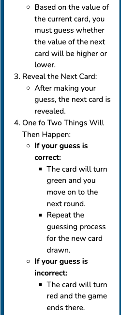
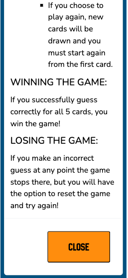

##### Reset Game Modal

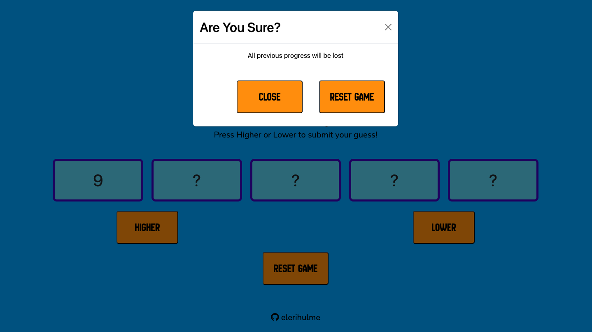

* The reset game modal is to double check that the user understands what happens when they reset the game to ensure that they don't lose their progress if that wasn't what they intended to do.
* The 'Reset Game' modal consists of:
 - A modal header asking the user if they are sure about reseting the game, and an 'x' button so the user can exit the modal and return to their game from the top of the modal.
 - A line of text in the modal boday informing the user that all their progress will be lost if they reset the game.
 - A modal footer with a 'close' button, so the user can close the modal and return to their game from the bottom of the modal, and a 'reset game' button so the user can continue and reset the game if that is what they wish to do.

 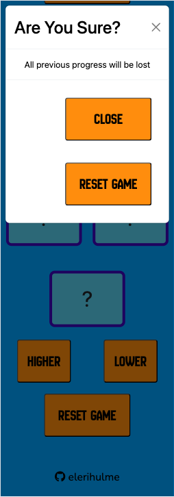
 
 #### Future Features

- custom 404 page

### Structure

#### User Flow diagram

This diagram shows how the user may interact and navigate through the website

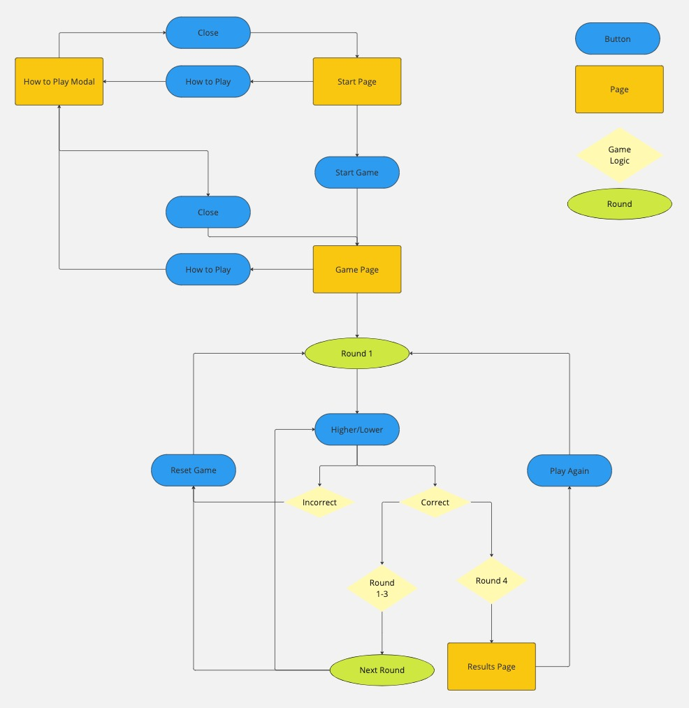

### Skeleton

#### Wireframes

##### Mobile

- 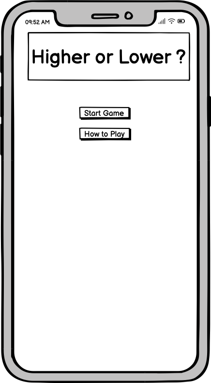
- 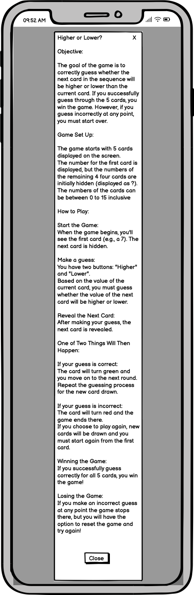
- 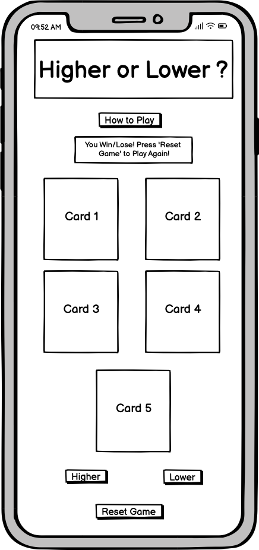
- 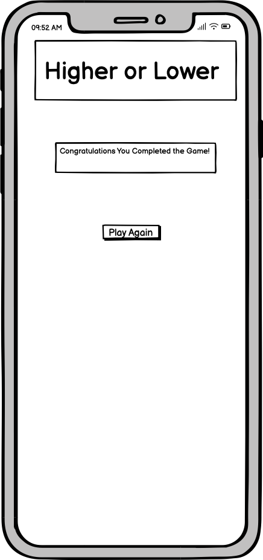

##### Desktop

- 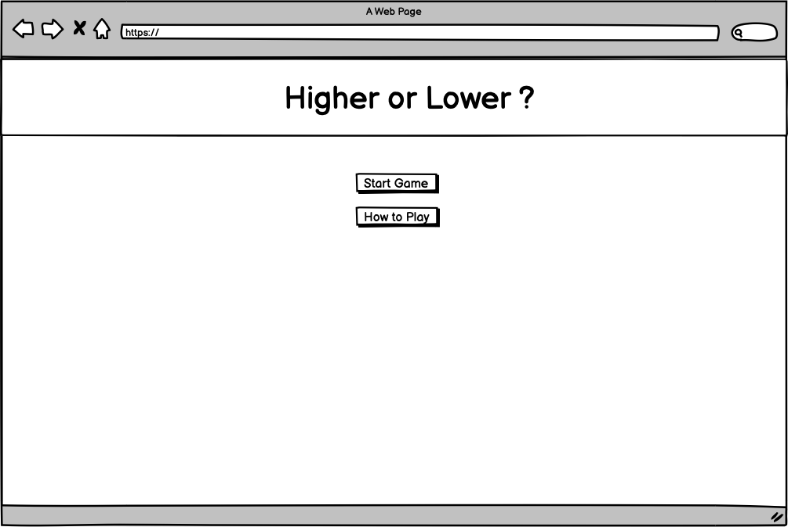
- 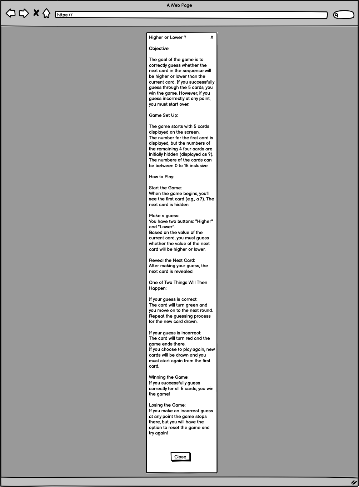
- 
- 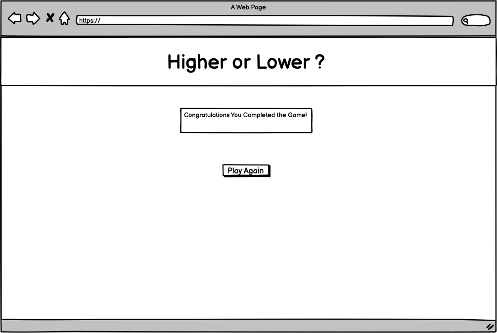

### Surface

#### Colours

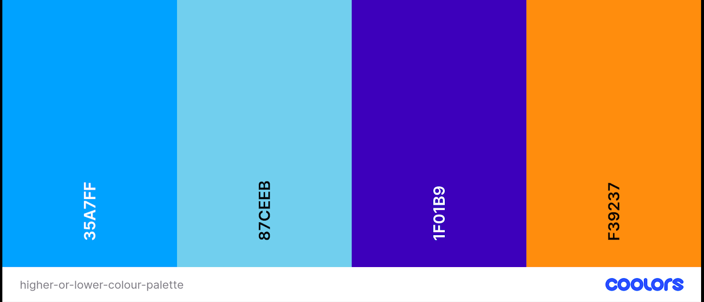

- The main theme colours were Argentinian Blue (#35A7FF) and Carrot Orange (#F39237) to create a loud and bright colour scheme to make the game look exciting and engaging to the user.
- Dark Blue (#1F01B9) was then used as border for each card to clearly define each card.
- Sky Blue (#87CEEB) was used initally as the background for each card to make the cards easily readable and as a neutral colour before they were truned Lime Green or Red so the user can quickly and easily tell if they were right or wrong as green is typically associated with correct and red with incorrect.

#### Typography

- Google font's 'New Amsterdam' was used for the headings and buttons as the block capitals look similar to the fonts used in retro games, making the website look instantly like a game so the user may quickly have a sense of the webpage's purpose.

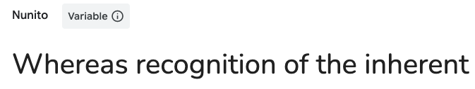

- Google font's 'Nunito' was used for any instructional text as the spacing and clarity of the letters makes the text easy to read and therefore will help the user understand any information easily.

## Testing

### Validation

* [HTML Validator](https://validator.w3.org/) was run the page to determine any HTML errors.
The only error found was a warning that there wasn't a heading element as the direct child of a section for the start and game sections.
However, there are cases where this is acceptable, paticularly in the case of links or buttons.
More information can be found [here](https://developer.mozilla.org/en-US/docs/Web/HTML/Element/section)

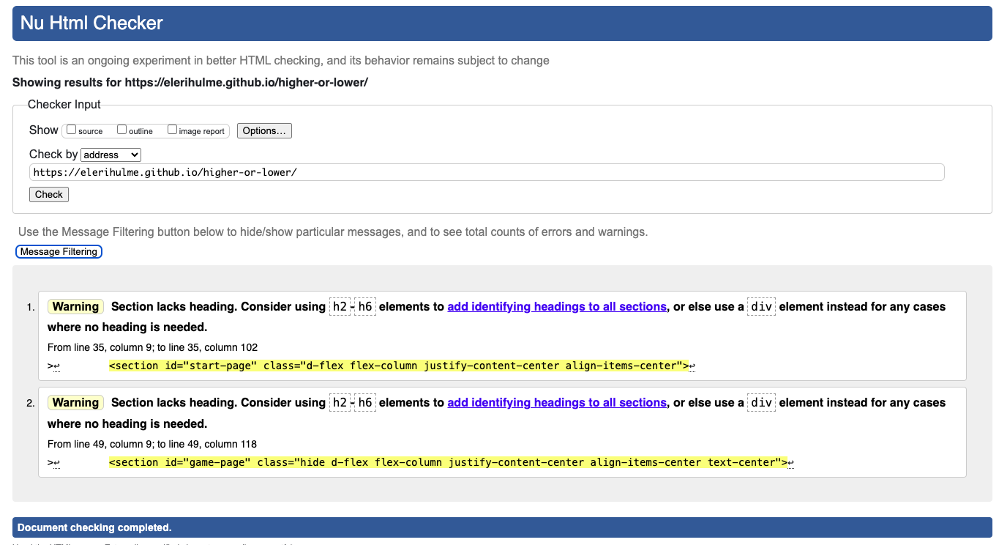

* [CSS Validator](https://validator.w3.org/) was run on the style sheet and there were no errors found.

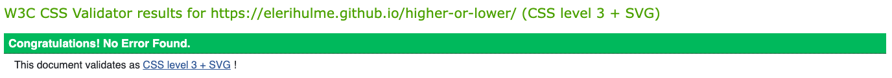

* Lighthouse in Chrome Developer Tools was used to check performance

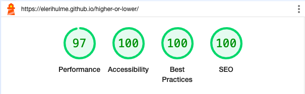

### Compatibility and Responsiveness

The website was tested on Chrome, Mozilla, Edge and Safari browsers with no problems found.

The website was tested on numerous sized screens including different desktop, tablet and mobile devices and was found to respond as expected to all sizes.

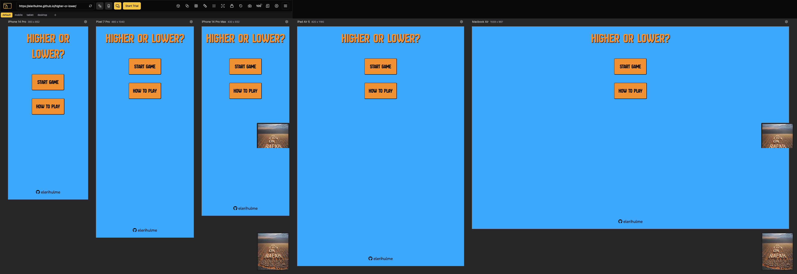
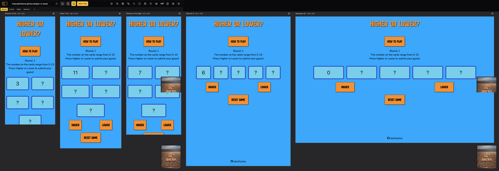

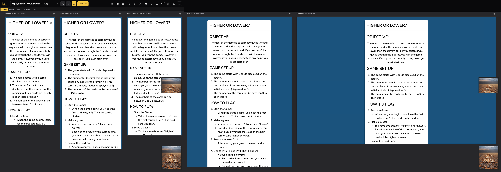
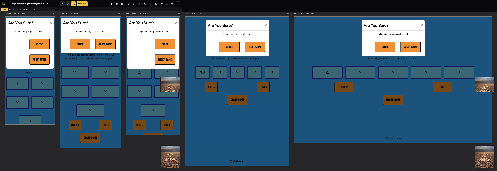

Chrome developer tools was used throughout the design process to check responsiveness and breakpoints. Adjustments were made accordingly.

### Manual Testing

| Feature | Action | Expected Result | Tested | Passed | Comments |
| --- | --- | --- | --- | --- | --- |
| Footer | | | | | |
| Github icon and username in the footer | Click on the Github icon and username | The user is redirected to my GitHub page | Yes | Yes | - |
| Hover effect | Hover over footer element | The icon changes colour | Yes | Yes | - |
| Start Section | | | | | |
| "Start Game" button | Click on the "Start Game" button | The user is redirected to the Game section | Yes | Yes | - |
| "How To Play" button | Click on the "How To Play" button | The "How To Play" modal appears | Yes | Yes | - |
| Game Section | | | | | |
|  |  |  |  |  | - |
| Results Section | | | | | |
|  |  |  |  |  | - |
| How To Play Modal | | | | | |
|  |  |  |  |  | - |
| Reset Game Modal | | | | | |
|  |  |  |  |  | - |

### Bugs

#### Solved Bugs

Bug:
When randomly selecting 5 number between 0 and 15 for the game.cards array it was possible for the same number to appear consecutively, and therefore neither higher or lower would be correct, making it impossible for the user to win.

Solution:
Instead of using a for loop which concluded after 5 iterations producing 5 numbers, a while loop was used and set to run until 5 numbers were pushed to the game.cards array and numbers were only pushed to the array if they were not already included in the array therefore no duplicate numbers would be present. In the game it makes it seem like there is only one of each card and therefore the same number could not appear twice. This  means the user always has a chance of being correct.

Bug:
When the user would guess incorrectly the game was still allowing them keep playing allowing them to change they're guess and always win.

Solution:
I added the game status key to the game object which would have the vale of either active or inactive and after an incorrect guess the game status was set to inactive the game would no longer process the user's guess meaning that they were unable to play the game until the game had been reset, setting the game status back to active.

#### Unsolved Bugs

None

## Deployment

### GitHub Pages

The site was deployed using GitHub Pages, as follows:

- Navigate to the GitHub repository.
- Click 'Settings'.
- Under 'Code and automation', select 'Pages'.
- On the 'GitHub Pages' section, under 'Build and deployment > Source' select 'Deploy from a branch'.
- Ensure that the 'main' branch has been selected, and then click 'Save'.

### Local Deployment

In order to make a local copy of this project, you can clone it.
In your IDE Terminal, type the following command to clone my repository:

- `git clone https://github.com/elerihulme/higher-or-lower.git`

## Credits

- [Bootstrap](https://getbootstrap.com/) was used for content structure, navigation elements, buttons and forms.
- [Font Awesome](https://fontawesome.com/) was used for all icons.
- Code was taken from [Materialize](https://materializecss.com/footer.html) to push the footer to the bottom of each page regardless of the content size.
- [Favicon] (https://favicon.io/) was used for creating and implementing the custom favicon
- [Am I Responsive](https://ui.dev/amiresponsive) was used to create the mock up images
- [Coolers](https://coolors.co/) was used to create the colour palette.
- [Google Fonts](https://fonts.google.com/) was used for all fonts.
- [Responsive Viewer](https://responsiveviewer.org/) extension was used to create images of the website's pages on a variety of devices.
- [GoFullPage](https://gofullpage.com/) extension was used in to capture full-sized images of the website's pages.

    
## Acknowledgements

- [Julia Konovalova](https://github.com/IuliiaKonovalova) was a great mentor throughout this project, guiding me to help shape the project and bring it to life.
- [Code Institute](https://codeinstitute.net/) for the knowledge to complete a project like this and to the tutors and slack community for their support and help.
- My friends and family for their feedback and help in testing the game.

---
